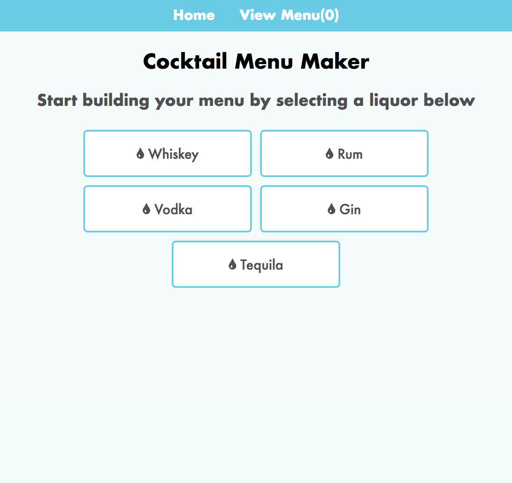
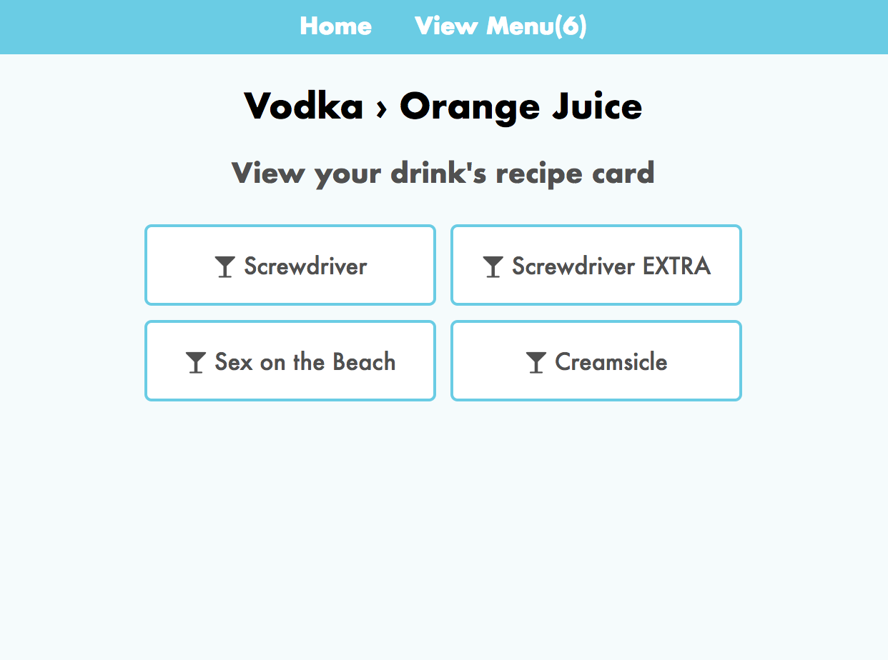
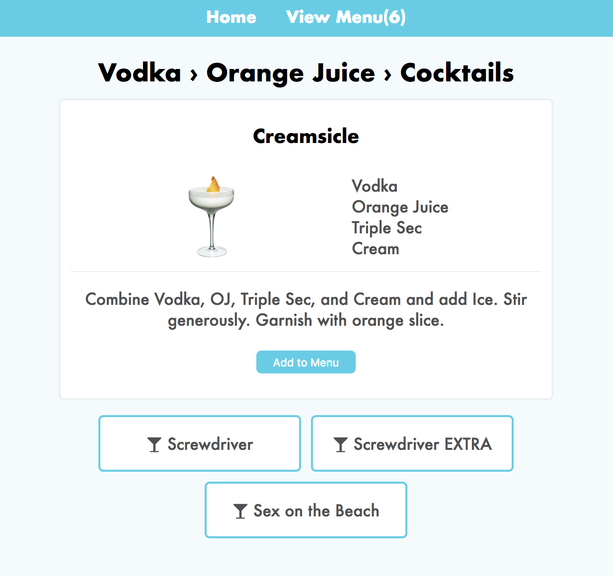
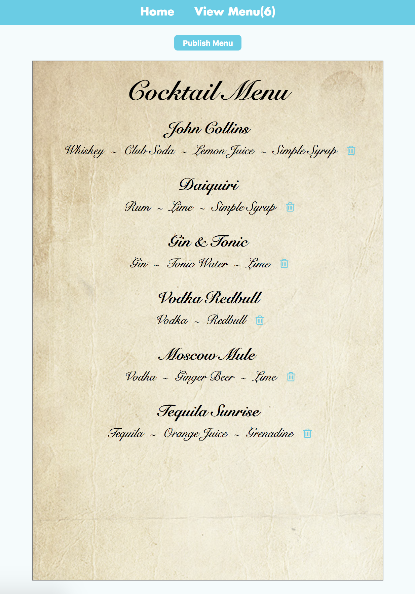

# Cocktail Menu Maker

### What is it?

Using the Cocktail Menu Maker, users can find cocktails based on the alcohol and mixing ingredients they select. For some, this will introduce them to new cocktails they may not have previously known about. For all users, however, this app allows them to create their own custom cocktail menus either for themselves or for groups of friends. 

### When would I use it?

Imagine that you're hosting a party and you want to make cocktails for your guests. Based on all the ingredients you're going to have at the party, you can create a custom menu that your friends can choose drinks off of. You can print out the menu for your friends to reference at the party or they can view it on their phones.

### Where can I test it?

Test out the app at the link below.

http://taxi-driver-kangaroo-18524.netlify.com/

## Technologies

### Front-End

The Cocktail Menu Maker uses React with reusable components. The liquor, base ingredient, and drink selection cards are all the same reusable component. Redux handles the state of the apps that is passed to each component, helping to customize what the user sees depending on what they've selected.

### Back-End

The app is connected to a database on mLab with two collection: one for the various cocktails in the app and one for users' custom, shareable menus. The cocktail collection connects to the app through a single GET endpoint, while the menu collection connects through both a GET endpoint and a POST endpoint. This allows users to create a menu on the fly and be able to access that menu at any time in the future (assuming they keep track of the link with the menu's ID).

#### Cocktails

Method  | Access | Description |
| ------- |------- | ----------- |
| GET     | Public | Pulls cocktails from database |

Pulls cocktails in JSON format:

{

  cocktailName,

  ingredients,

  alcohol,

  baseLiquid,

  thumbnail,

  recipe

}

#### Menus

Method  | Access | Description |
| ------- |------- | ----------- |
| GET     | Public | Pulls menus from database |

Method  | Access | Description |
| ------- |------- | ----------- |
| POST     | Public | Adds state-held menu to database |

Pulls and send menus in JSON format:

{

  menuItems: [{

    cocktailName,

    ingredients,

    alcohol,

    baseLiquid,

    thumbnail,

    recipe

  }]

}

## How to use the app

### Choose your liquor

When users load up the app, they will instantly be able to choose the main alcoholic ingredient in the cocktail they're searching for or want to find a new recipe with. Users will always be able to return to this page by clicking "Home" in the navigation bar present at the top of the app on each page. Choosing a liquor is as simple as clicking on the one you want or tapping it on a touchscreen.

### Choose your base ingredient

After selecting the main alcoholic ingredient, users will be presented with a list of base mixing ingredients. The list may be different depending on what liquor they chose, as the base mixing ingredients rendered are only for drinks with the previously-selected liquor are their main alcoholic ingredient. You wouldn't want to choose a base ingredient and have no cocktail results!

### Choose your cocktail

After selecting the base mixing ingredient, you will see a similar screen to the last two, on which you can choose a cocktail based on your previously-selected ingredients. Clicking or tapping on one will bring up the recipe card for that cocktail. Here you can see a picture of the cocktail, the ingredients, and a description on how to make the drink. Underneath the card you will see the cocktail option cards if you would like to see the recipe for one of the other cocktails using your selected ingredients.

At the bottom of the recipe card is a button to add the cocktail to your menu.

### View your cocktail menu

At any time using the app, you can click on "View Menu" in the navigation bar to see your cocktail menu. The menu is essentially a preview of what your shareable menu will look like, except you can still add cocktails to and delete cocktails from the menu before you publish. 

At the top of the menu page is a "Publish Menu" button. This will open a new tab with your shareable menu that is now saved in the database.
